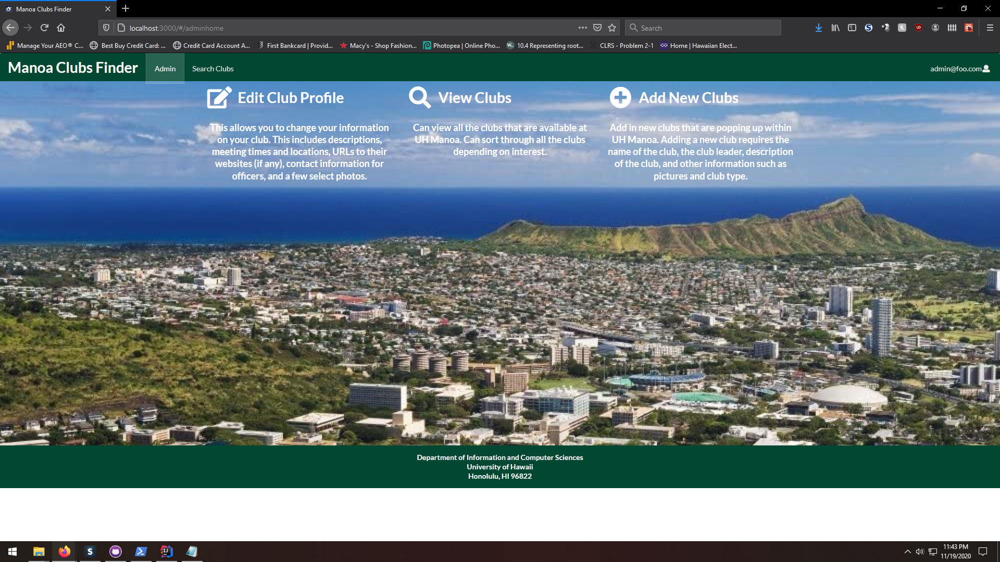

<div class="images">
  
</div>

The Manoa Club Finder is an application meant for student to host and/or find clubs that appeal to their hobbies and interest. This was a group project assigned to me and my groupmates. The main function is for it to be a club database so people can easily search for the right club or for the club to promote themselves and find more like mind individuals. The application features a club filter to show the different fields of club such as academic or recreational.  Each club listing contains the name, the club leader and their contact information, some description, and pictures, and URLS to their own site if any. There are three users: normal, club admin, and super admin. The user can only see and filter the clubs, the club admin is able to edit own their clubs, and the super admin can edit and add clubs.
My task of the group was to allow only the club admin to edit their individual club, some were leader of a couple clubs, so they were allowed to edit them too. The logic behind it was not too bad, it was more the actual coding that gave me the most trouble
```
emailCheck() {
  return Meteor.user().emails[0].address === this.props.club.contactInfo;
}
```
This was my helper function to check the current user email address and compare it the email of the clubs. It looks simple and it was simple but it took some time since meteor user method was a bit confusing. I also populate the default club database; it was just very tedious. 

The main thing I took out of this was how to work in a group more effective. Before my previous group mates and I would only meet up once a week to work on the project then and later got confused on what needed to be done. With GitHub and the project management board, we are able to work on current issue instead of assigning each person a task and waiting on them to finish. We kept track of our progress and was able to work at our own pace. It felt more professional rather than some assignment that needs to be done. 


Check out [Manoa Club Finder](https://manoa-clubs-finder.xyz/#/) here.
