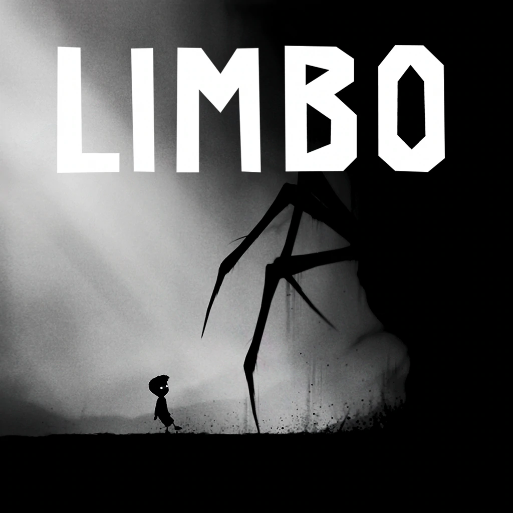

Due to Covid, a lot of activites and pastimes are put on hold to stop the spread of the virus. One of them is going to the theatre to watch people perform, can't really put a couple hundred people in a room at this current time.
The goal of this project is to let people experience a play at home via a game. We're are still in the early talk of how to approach this project but the way it differ from a movie is the audience interaction. According to the other members, there is a interaction between the actors on stage and the audience, I haven't quite understand this yet.

As of 9/4/20, we have just begun formulating ideas. I'm bringing in my experiences with gaming and coding while they are the script writter and director. This would be a challenge as we have to maintain the border of actor and audience while letting the audience engage along side the story. The premise of the story revolves around races and how the justice system differ between them.

Unfortunately the project fell through and there was no work or plans regarding this story. It was something that I had great interest in. The concept of visual novel game is nothing new and there are plenty of story driven games, I felt like this project could have been different from the rest and maybe achieve something great.

  

I wanted to bring up Limbo, a puzzle platformer gamer that I was planning to draw inspiration from. It had a simplisic design and the coloring of the game fit thematically with the idea of the play. Because it is simple, we can do so many things like represent the duality of race with the color, represent a character mental state with the stage of the game, the list goes on. But the project has been dropped, the could had being are now just what ifs. Maybe one day I will take this on.
